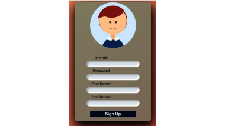
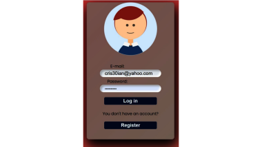
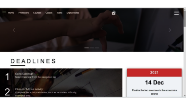
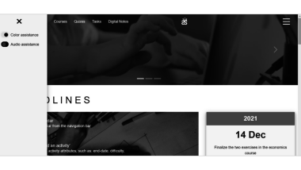
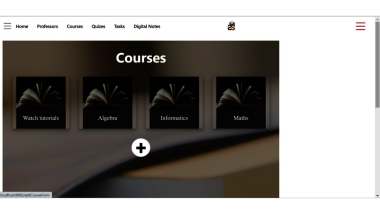
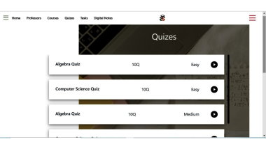

# HackathonEndavaBlue
ENG: Web Application developed in a team of five for a Hackaton hold by Endava. 
The purpose of the app is to help students get organised for studying, being 
able to keep track of courses and tasks. They can also take quizzes and gain 
points for consolidating their knowledge. A remarkable feature is represented 
by the OCR, which allows the user to scan pages and retrieve the text within. 
Also, the app is designed for color-blind users, turning everything black&white.

R0:
Ideea de baza a proiectului nostru este de a pune la dispozitia elevilor/studentilor 
majoritatea tool-urilor necesare in buna desfasurare a procesului edcuativ.

Prezentarea pe larg se află aici: https://prezi.com/p/3aaxtpgqt8pd/studsource/.

Sign up:

Log in:

Deadlines:

Deadlines b&w:

Courses:

Quizzes:

